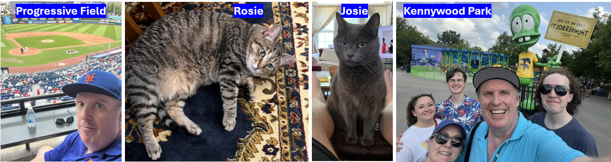

# 431 Class 02: 2026-08-27

[Main Website](https://thomaselove.github.io/431-2026/) | [Calendar](https://thomaselove.github.io/431-2026/calendar.html) | [Syllabus](https://thomaselove.github.io/431-syllabus-2026/) | [Book](https://thomaselove.github.io/431-book/) | [Contact Us](https://thomaselove.github.io/431-2026/contact.html) | [Canvas](https://canvas.case.edu) | [Data and Code](https://github.com/THOMASELOVE/431-data)
:-----------: | :--------------: | :----------: | :---------: | :-------------: | :-----------: | :------------:
for everything | for deadlines | expectations | from Dr. Love | get help | lab submission | for downloads

## Today's Opener: The Quick Survey

As you come in, **please take** a paper survey with questions on both sides. Please read these instructions carefully before writing anything down.

1. Introduce yourself to someone near you.
2. Record the survey answers **for that other person**, while they record your responses.
3. Be sure to complete all of the questions (on both sides of the paper).
4. When you are finished, thank your partner and raise your hand. Someone will come around to collect your survey.

Here is a [PDF version of this survey](class02-survey-431-2026.pdf), which might be helpful to you after you turn in the paper version.

## August 2026

## Today's Slides

Class | Date | HTML | Word | Quarto | Recording
:---: | :--------: | :------: | :------: | :------: | :-------------:
02 | 2026-08-27 | **[Slides 02](https://thomaselove.github.io/431-slides-2026/class02.html)** | **[Word 02](https://thomaselove.github.io/431-slides-2026/class02w.docx)** | **[Code 02](https://github.com/THOMASELOVE/431-slides-2026/blob/main/class02.qmd)** | Visit [Canvas](https://canvas.case.edu/), select **Zoom** and **Cloud Recordings**

- The HTML link provides the RevealJS version of the slides that I suggest you focus on during class, as it's the [most capable format](https://quarto.org/docs/presentations/revealjs/).
- Some people prefer the Word version to the HTML version for live note-taking, so I've provided a link to download that version.
- The Quarto file link provides the code I used (in [Quarto](https://quarto.org/)) to build the slides. Hit the download button after clicking the link above if you want the `.qmd` file.
- To print the HTML slides **to pdf**, [follow these instructions](https://quarto.org/docs/presentations/revealjs/presenting.html#print-to-pdf) using Google Chrome as your browser.
- We (attempt to) record all 431 classes via Zoom and post the recording to Canvas. To access the Class recordings, visit [Canvas](https://canvas.case.edu/), select our course, then select *Zoom* and then *Cloud Recordings*. Select the recording you want to view, and you should then be able to either download it or watch it online.

## Questions? Need help?

- Attend [TA office hours](https://thomaselove.github.io/431-2026/calendar.html#ta-office-hours) (starting Sunday) or email **431-help at case dot edu** (available now) you have questions about the materials.
    - The office hours schedule is available on our [Contact Us](https://thomaselove.github.io/431-2026/contact.html) and [Calendar](https://thomaselove.github.io/431-2026/calendar.html#ta-office-hours) pages, and the Zoom links are found in a document on [our Shared Google Drive](https://thomaselove.github.io/431-2026/google.html).
    - Email Dr. Love directly at Thomas dot Love at case dot edu if you have questions about class logistics that aren't addressed in the [Syllabus](https://thomaselove.github.io/431-syllabus-2026/) or the [Calendar](https://thomaselove.github.io/431-2026/calendar.html). If you want to get in touch with me outside of class, the best option is always to **email** me.

## Announcements

1. **Getting into the Robbins building** If your ID doesn't let you into the building, please contact Kim Krajcovic at kxk917 at case dot edu in the Department of Population and Quantitative Health Sciences. She will need your student id number in order to enable your building access.
2. You should now see the [Shared Drive](https://thomaselove.github.io/431-2026/google.html) for this class on Google Drive, so long as you're logged into Google via your CWRU account and are officially registered for the course.
    - A roster of students will appear on the Shared Drive by class time.
4. **Helping me out** If you find a typo or other error in any of our materials, email me, and I'll award you some bonus credit if you're the first to let me know.
5. If you're going to miss **three or more consecutive** classes, or if you're going to leave a class **early** then let me know that via email.
    - Watch the recordings and make sure you catch up as soon as possible if you miss class.
6. **Using R and RStudio** We'll be demonstrating the use of R and RStudio in more detail starting with class 3, so please get the [software](https://thomaselove.github.io/431-2026/software.html) set up this weekend if you haven't already.
    - **New Data posted and coming** I've added new files to the [431-data page](https://github.com/THOMASELOVE/431-data) since Class 1 (and more will appear later this week), so you may want to pull the data down again, if you've done it already.
7. The Cleveland Chapter of the [American Statistical Association](https://www.amstat.org/membership/become-a-member) (ASA) will host its fall conference on Monday 2026-09-28 entitled "[Quick-thinking, Confident, Communicative, and Collaborative: Fundamentals of Applied Improvisation for (Bio)statisticians and Data Scientists](ASA_2026-09-28_flyer.pdf)" More details, including registration information, are available [on this flyer](ASA_2026-09-28_flyer.pdf). Student price for this half-day event is $10.

## Reading (before Class 03)

- Spiegelhalter *The Art of Statistics* Introduction and Chapters 1 (Getting Things in Proportion) and 2 (Summarizing and Communicating Numbers)
- [R for Data Science](https://r4ds.hadley.nz/) (2nd edition): Introduction, and start Sections 1-8 ("Whole game")
- By the end of next week (Class 04) we will have discussed material also discussed in [the Course Book](https://thomaselove.github.io/431-book/): Chapters 1-4.

## One Last Thing

I do [theater](https://github.com/THOMASELOVE/theater), sometimes. I am appearing in the musical [The Fantasticks](https://theatreinthecircle.org/) at Theatre in the Circle (located at Judson Manor, steps from the CWRU campus) on September 11-13. For more information or to purchase tickets, visit <https://theatreinthecircle.org/>.

### If I'm a student/friend/neighbor/colleague of yours, are you expecting me to come see you in theater?

I'm always delighted to see anyone I know at any show I do. Please do come if you are interested. I also have various professional roles (as a teacher, for example) where I have some nominal control over other people's happiness or work. If you're someone who interacts with me professionally, please feel **no** obligation to attend a show I'm in. **Attending (or not attending) a show I'm in carries no weight with me at all in any professional capacity.**
