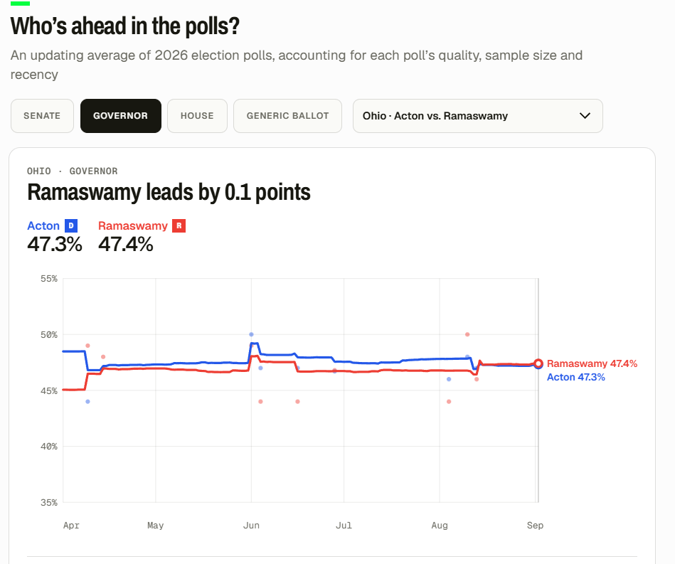
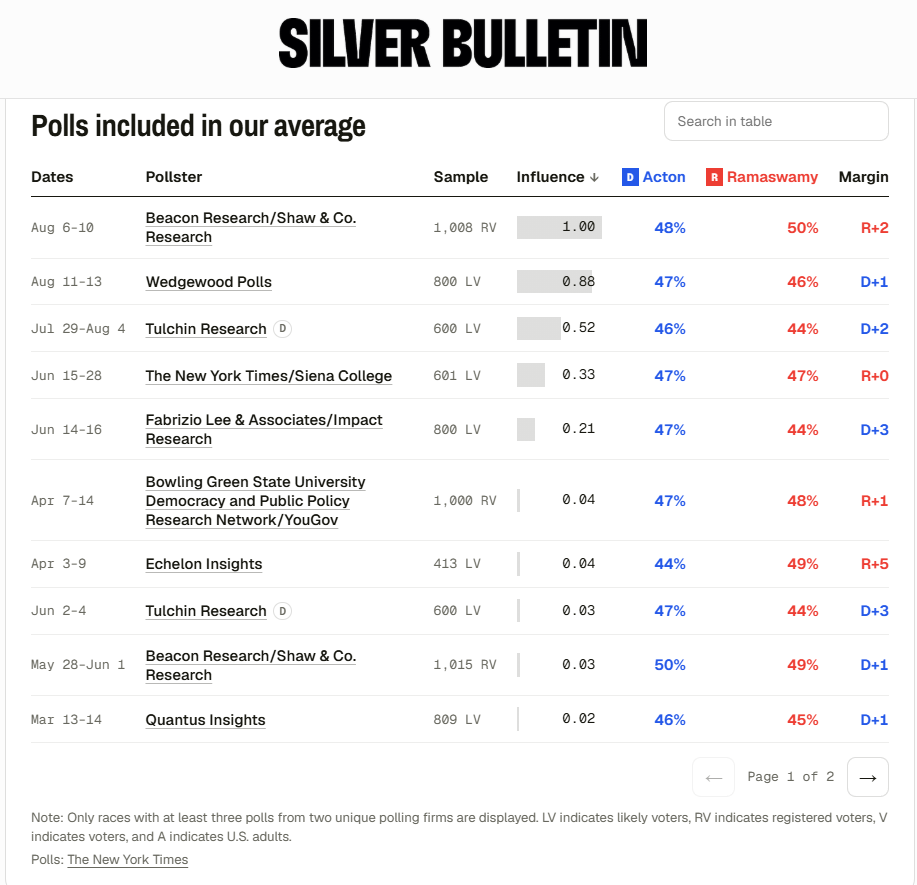

# 431 Class 04: 2026-09-03

[Main Website](https://thomaselove.github.io/431-2026/) | [Calendar](https://thomaselove.github.io/431-2026/calendar.html) | [Syllabus](https://thomaselove.github.io/431-syllabus-2026/) | [Book](https://thomaselove.github.io/431-book/) | [Contact Us](https://thomaselove.github.io/431-2026/contact.html) | [Canvas](https://canvas.case.edu) | [Data and Code](https://github.com/THOMASELOVE/431-data)
:-----------: | :--------------: | :----------: | :---------: | :-------------: | :-----------: | :------------:
for everything | for deadlines | expectations | from Dr. Love | get help | lab submission | for downloads

## Today's Slides

Class | Date | HTML | Word | Quarto | Recording
:---: | :--------: | :------: | :------: | :------: | :-------------:
04 | 2026-09-03 | **[Slides 04](https://thomaselove.github.io/431-slides-2026/class04.html)** | **[Word 04](https://thomaselove.github.io/431-slides-2026/class04w.docx)** | **[Code 04](https://github.com/THOMASELOVE/431-slides-2026/blob/main/class04.qmd)** | Visit [Canvas](https://canvas.case.edu/), select **Zoom** and **Cloud Recordings**

- The HTML link provides the RevealJS version of the slides that I suggest you focus on during class, as it's the [most capable format](https://quarto.org/docs/presentations/revealjs/).
- Some people prefer the Word version to the HTML version for live note-taking, so I've provided a link to download that version.
- The Quarto file link provides the code I used (in [Quarto](https://quarto.org/)) to build the slides. Hit the download button after clicking the link above if you want the `.qmd` file.
- To print the HTML slides **to pdf**, [follow these instructions](https://quarto.org/docs/presentations/revealjs/presenting.html#print-to-pdf) using Google Chrome as your browser.
- We (attempt to) record all 431 classes via Zoom and post the recording to Canvas.

## Announcements

1. Feedback on the Minute Paper after Class 3 is available now at <https://tinyurl.com/431-2026-feedback-min-03>. You must be logged into Google via CWRU to see the feedback.
2. [Lab 1](https://github.com/THOMASELOVE/431-labs-2026/tree/main/lab1/) is due next Wednesday 2026-09-09. At the end of today's class, you should be able to complete the Lab.
3. If you haven't yet [sent me your Favorite Movie](https://thomaselove.github.io/431-syllabus-2026/13_movies.html), please do so now. [Behold](https://github.com/THOMASELOVE/431-classes-2026/blob/main/movies/movies_2026.md) the current list.
4. In Class 3, we had an issue with [slide 42](https://thomaselove.github.io/431-slides-2026/class03.html#/toothgrowth-summarizing-len). I've figured out the problem, and we'll take a look at [the repaired slide](https://thomaselove.github.io/431-slides-2026/class03.html#/toothgrowth-summarizing-len) during class.
    - In brief, the problem is that there are [many ways (9, in fact)](https://stat.ethz.ch/R-manual/R-devel/library/stats/html/quantile.html) to define a quantile implemented in R, and the `describe_distribution()` function from **easystats** uses type 6 for the IQR, but type 7 (the default, and the one I use) for the quartiles.
5. As mentioned in today's slides, there is a file called [class04_survey_complete.qmd](class04_survey_complete.qmd) which is available on this page, and on [our 431-data page](https://github.com/THOMASELOVE/431-data). If you like, you can open this file in RStudio and render it to see the resulting HTML document like you'll prepare for [Lab 1](https://github.com/THOMASELOVE/431-labs-2026/tree/main/lab1/).
    - As always, you also have the Quarto [code I used to create today's slides](https://github.com/THOMASELOVE/431-slides-2026/blob/main/class04.qmd) in its usual place above.

## On Asking for Help...

[Dr. Angela Duckworth](https://en.wikipedia.org/wiki/Angela_Duckworth) wrote a guest essay in the NY Times published 2026-08-26 entitled [I Study Successful People. They Have One Habit in Common](https://www.nytimes.com/2026/08/28/opinion/successful-people-help.html). A key pair of quotes for me:

> Most people understand the importance of asking for help in a life-or-death crisis. We know we should wave to the lifeguard during a riptide or call 911 if our house catches fire. But in our personal and professional lives, Americans are encouraged to pursue rugged individualism over interdependency. ... You might think I’d love the image of the solo striver triumphing over every challenge. After all, I’m a psychologist who wrote a book called “Grit” about the necessity of passion and perseverance for achieving long-term goals. The truth is, I hate it. Without exception, every high performer I’ve studied credits a host of supporters for success. **Research has found that a willingness to ask for help is crucial to achievement.**

> Studies [show](https://www.sciencedirect.com/science/article/abs/pii/0273229781900198) that knowing when to ask for help is an essential skill for children’s learning and achievement. College students who proactively seek assistance from others typically [outperform](https://doi.org/10.1037/edu0000725) those who avoid doing so. In adulthood, seeking support is an effective strategy for [regulating](https://journals.sagepub.com/doi/10.1177/02654075251335816#fig5-02654075251335816) our emotions, and having a support network is a reliable [predictor](https://pubmed.ncbi.nlm.nih.gov/38695783/) of overall mental health.

----------------

## Reading (before Class 05)

- Spiegelhalter *The Art of Statistics* Chapter 3 (Why are we looking at data anyway?) *We will read Chapter 4 later this term*.
- [R for Data Science](https://r4ds.hadley.nz/) (2nd edition): complete Sections 1-8 ("Whole game")
- Next week (Classes 05-06) we will discuss material related to [the Course Book](https://thomaselove.github.io/431-book/): Chapters 5-7.

## One Last Thing (We didn't get to this in class, but we'll discuss similar results later this term)

From [Silver Bulletin](https://www.natesilver.net/), 2026-09-02

## The Fantasticks 

I am appearing in the musical [The Fantasticks](https://theatreinthecircle.org/) at Theatre in the Circle (located at Judson Manor, steps from the CWRU campus) on September 11-12. For more information or to purchase tickets, visit https://theatreinthecircle.org/. The Sunday September 13 performance is already sold out.

