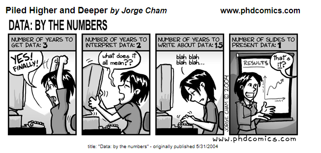

# 431 Class 05: 2026-09-08

[Main Website](https://thomaselove.github.io/431-2026/) | [Calendar](https://thomaselove.github.io/431-2026/calendar.html) | [Syllabus](https://thomaselove.github.io/431-syllabus-2026/) | [Book](https://thomaselove.github.io/431-book/) | [Contact Us](https://thomaselove.github.io/431-2026/contact.html) | [Canvas](https://canvas.case.edu) | [Data and Code](https://github.com/THOMASELOVE/431-data)
:-----------: | :--------------: | :----------: | :---------: | :-------------: | :-----------: | :------------:
for everything | for deadlines | expectations | from Dr. Love | get help | lab submission | for downloads

## Today's Slides

Class | Date | HTML | Word | Quarto | Recording
:---: | :--------: | :------: | :------: | :------: | :-------------:
05 | 2026-09-08 | **[Slides 05](https://thomaselove.github.io/431-slides-2026/class05.html)** | **[Word 05](https://thomaselove.github.io/431-slides-2026/class05w.docx)** | **[Code 05](https://github.com/THOMASELOVE/431-slides-2026/blob/main/class05.qmd)** | Visit [Canvas](https://canvas.case.edu/), select **Zoom** and **Cloud Recordings**

  [Source](https://phdcomics.com/comics.php?f=462)

## Announcements

1. There is a [Minute Paper after Class 5](https://tinyurl.com/431-2026-minute-05) due tomorrow (Wednesday 2026-09-09) at noon.
2. [Lab 1](https://github.com/THOMASELOVE/431-labs-2026/tree/main/lab1) is also due tomorrow at noon.
    - After completing Lab 1, you'll probably want to get started on [Lab 2](https://github.com/THOMASELOVE/431-labs-2026/tree/main/lab2) (due Wednesday 2026-09-16 at noon.) After Class 6, we'll have demonstrated all R things in Lab 2 that you'll need to know.
    - [Lab 5](https://github.com/THOMASELOVE/431-labs-2026/tree/main/lab5) involves building a personal website, and you can start working on that *now*, if you like, even though it's not due until early November. This is a great way to get ahead. There's nothing more you need from me in class to complete that Lab.
3. The favorite movies list for 2026 is [now complete](https://github.com/THOMASELOVE/431-classes-2026/blob/main/movies/movies_2026.md). We'll start discussing these in Class 08. The Minute Paper due tomorrow asks you to tell us whether or not you've seen each of the first 21 movies. We'll ask about the other 20 in next week's Minute Paper.
4. On 2026-09-04, I emailed you twice. The first explained the purpose of your **431 Lab Code**, and that email's subject line was "431 Lab Code (useful to you for obtaining feedback on Labs and checking grades on Minute Papers)". The second email contained your actual 431 Lab Code and the subject line was **Your 431 Lab Code**. If you missed either of these emails, then email me to get another copy.
    - Be sure that you take a look at the Grade Roster for 431 Students: Fall 2026 posted to [our Shared Google Drive](https://thomaselove.github.io/431-2026/google.html), so you can see what's available there now, and what will appear as the semester continues.
5. There was an error in [slides 39-40 from Class 4](https://thomaselove.github.io/431-slides-2026/class04.html#/visualizing-the-distributions), where I accidentally plotted the same variable twice. I sent an email explaining this on 2026-09-03 at 6 PM. All of the materials are fixed in the Class 4 README and on our 431-Data page.

## Posit Cheat Sheets

[Posit Cheat Sheets are available](https://rstudio.github.io/cheatsheets/), and they are an outstanding resource.

## Do you have other R resources to recommend?

Yes, the ones posted to [our Resources page](https://thomaselove.github.io/431-2026/resources.html#getting-better-at-r-rstudio-and-quarto) are all good.

---------------

## Reminders

- [Lab 1](https://github.com/THOMASELOVE/431-labs-2026/tree/main/lab1) and the [Minute Paper after Class 5](https://tinyurl.com/431-2026-minute-05) are due Wednesday 2026-09-09 at noon. Thanks.

## One Last Thing

**To come.**

## The Fantasticks 

I am appearing in the musical [The Fantasticks](https://theatreinthecircle.org/) at Theatre in the Circle (located at Judson Manor, steps from the CWRU campus) this Friday evening and Saturday afternoon September 11-12 (September 13 is sold out.) For more information or to purchase tickets, visit https://theatreinthecircle.org/.
