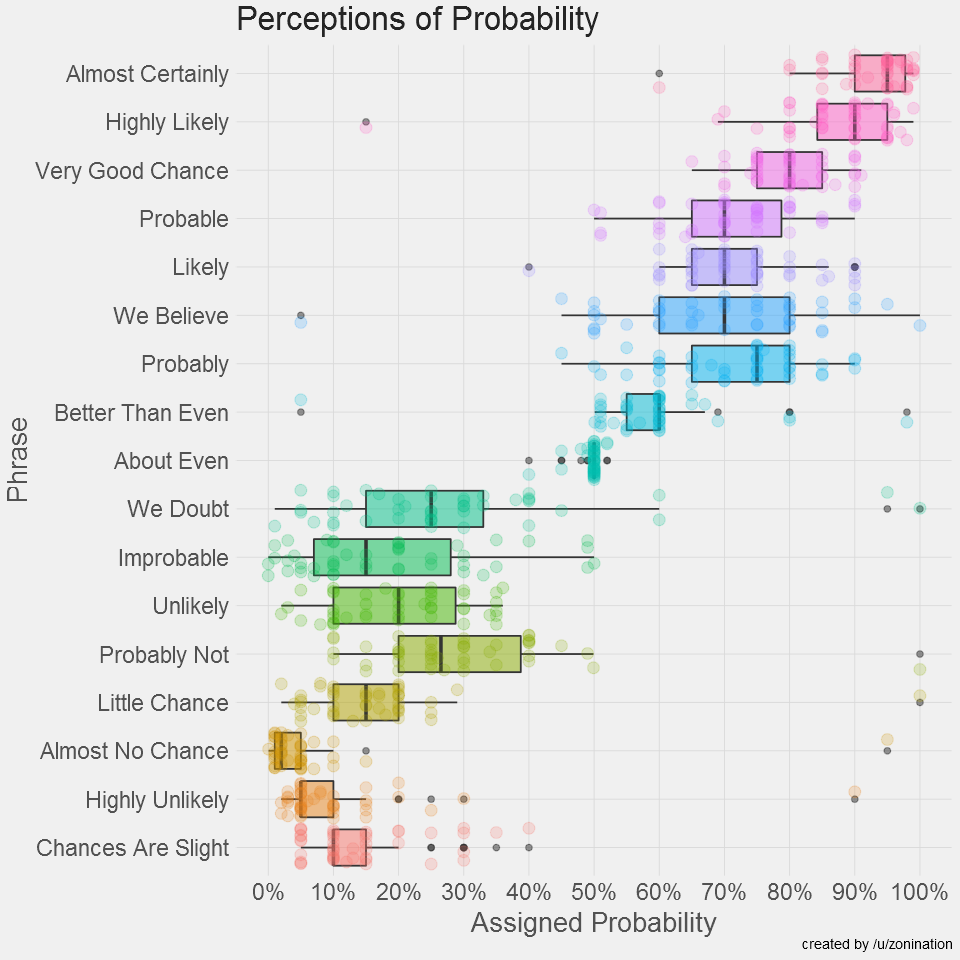

# 431 Class 08: 2026-09-17

[Main Website](https://thomaselove.github.io/431-2026/) | [Calendar](https://thomaselove.github.io/431-2026/calendar.html) | [Syllabus](https://thomaselove.github.io/431-syllabus-2026/) | [Book](https://thomaselove.github.io/431-book/) | [Contact Us](https://thomaselove.github.io/431-2026/contact.html) | [Canvas](https://canvas.case.edu) | [Data and Code](https://github.com/THOMASELOVE/431-data)
:-----------: | :--------------: | :----------: | :---------: | :-------------: | :-----------: | :------------:
for everything | for deadlines | expectations | from Dr. Love | get help | lab submission | for downloads

## Today's Slides

Class | Date | HTML | Word | Quarto | Recording
:---: | :--------: | :------: | :------: | :------: | :-------------:
08 | 2026-09-17 | **[Slides 08](https://thomaselove.github.io/431-slides-2026/class08.html)** | **[Word 08](https://thomaselove.github.io/431-slides-2026/class08w.docx)** | **[Code 08](https://github.com/THOMASELOVE/431-slides-2026/blob/main/class08.qmd)** | Visit [Canvas](https://canvas.case.edu/), select **Zoom** and **Cloud Recordings**

## Announcements

1. Feedback on the Minute Paper after Class 7 will appear **by class time**.
2. The answer sketch and grading rubric for Lab 2 will appear **by noon Friday** (or sooner if everyone submits the Lab on time.)
3. For the last part of today's class, we'll be discussing [our favorite movies](

----------

## Favorite Movies Discussion 1

For today's discussion, [we'll go to this link](https://github.com/THOMASELOVE/431-classes-2026/blob/main/movies/class08.md).

The link above describes some information about the `2026_movies_list` Google Sheet now found in our Shared Google Drive. 

- That sheet describes the **41** movies selected as a "favorite movie" by students in 431 in the Fall 2026 version of this course.
- It includes 33 variables related to these movies.
    - I developed the data and variable descriptions and sources tabs in the sheet mostly using [IMDB](https://www.imdb.com/).
    - On Tuesday, we'll be looking at a larger set of data, including "favorite movies" from students in 2020-2025, as well.
- In future classes, we'll augment this database in several ways, and we'll develop (and try to explore) some research questions.
- **In Class 12 (2026-11-01), you will help me identify other available public sources of interesting movie data, so you might give that a little thought.**
    - In addition to [IMDB](https://www.imdb.com/), some other sites I have used in the past to gather data about movies include <https://www.rottentomatoes.com/>, <https://www.flickchart.com/>, <https://letterboxd.com/> and <https://the-numbers.com/>.

## Reading (before Class 09)

- Spiegelhalter *The Art of Statistics* Chapter 7 (How Sure Can We Be About What Is Going On?) *Note: we'll read Chapter 6 later this term.*
- [R for Data Science](https://r4ds.hadley.nz/) (2nd edition): Sections 16 and 28
- Next week (Classes 09-10) we will discuss material related to [the Course Book](https://thomaselove.github.io/431-book/): Chapters 10-11.

## One Last Thing

 from [this link](https://github.com/zonination/perceptions)
