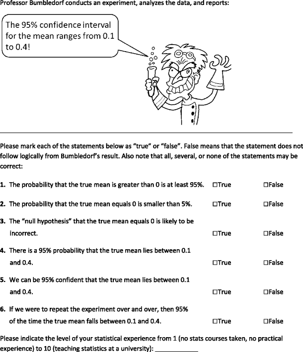

# 431 Class 14: 2026-10-08

[Main Website](https://thomaselove.github.io/431-2026/) | [Calendar](https://thomaselove.github.io/431-2026/calendar.html) | [Syllabus](https://thomaselove.github.io/431-syllabus-2026/) | [Book](https://thomaselove.github.io/431-book/) | [Contact Us](https://thomaselove.github.io/431-2026/contact.html) | [Canvas](https://canvas.case.edu) | [Data and Code](https://github.com/THOMASELOVE/431-data)
:-----------: | :--------------: | :----------: | :---------: | :-------------: | :-----------: | :------------:
for everything | for deadlines | expectations | from Dr. Love | get help | lab submission | for downloads

## Today's Slides

Class | Date | HTML | Word | Quarto | Recording
:---: | :--------: | :------: | :------: | :------: | :-------------:
14 | 2026-10-08 | **[Slides 14](https://thomaselove.github.io/431-slides-2026/class14.html)** | **[Word 14](https://thomaselove.github.io/431-slides-2026/class14w.docx)** | **[Code 14](https://github.com/THOMASELOVE/431-slides-2026/blob/main/class14.qmd)** | Visit [Canvas](https://canvas.case.edu/), select **Zoom** and **Cloud Recordings**

## Announcements

1. Quiz 1 will be available to you tomorrow by 5 PM. It is due Wednesday 2026-10-14 at noon.
2. The Lab 4 answer sketch and grading rubric will be posted to our Shared Drive as soon as possible.
3. Feedback on the Minute Paper after Class 13 will be posted by class time.

## A little quiz

 [Source](https://link.springer.com/article/10.3758/s13423-013-0572-3#appendices)

